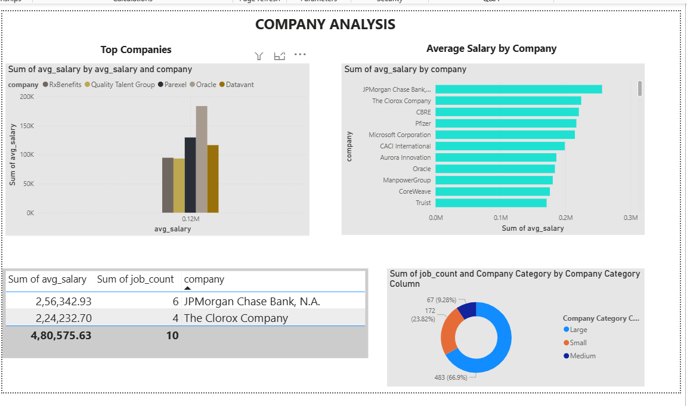
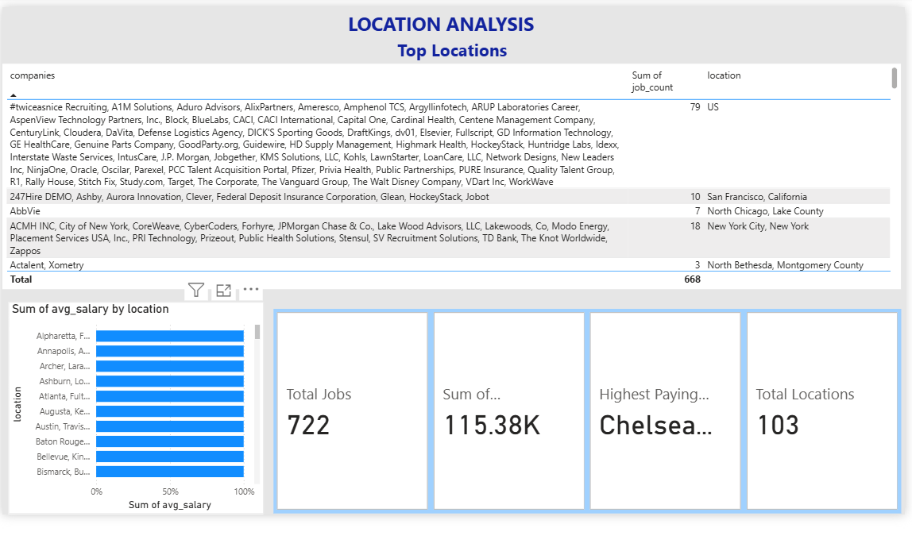
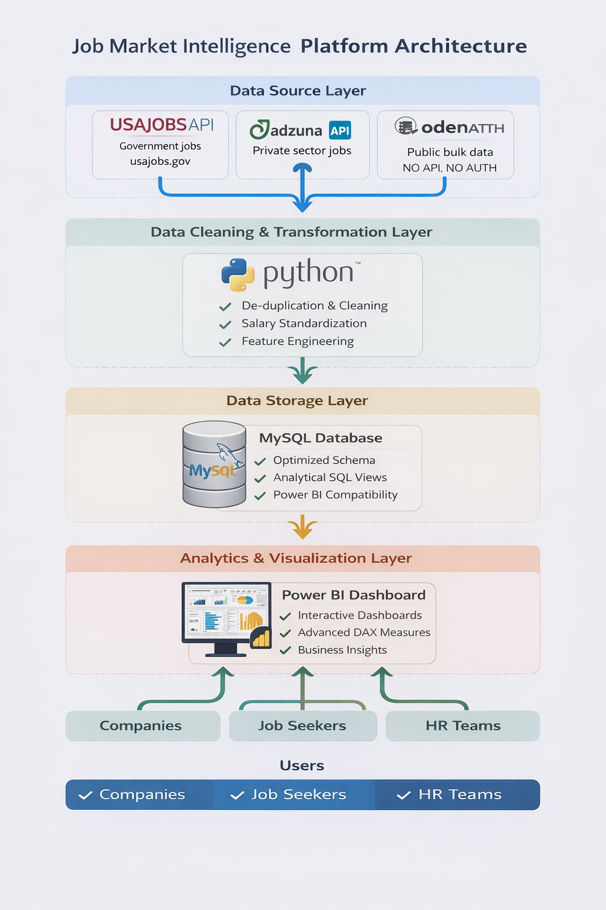

# Job Market Analytics Dashboard
*A comprehensive Power BI dashboard for real-time job market analysis with automated data pipelines.*
 
 ## Project Overview
This end-to-end data analytics project transforms raw job market data into actionable business intelligence through a 4-page interactive Power BI dashboard. The system features automated data collection, MySQL data warehousing, and cloud deployment with scheduled refresh.
### Page 1: Executive Dashboard – Job Market Overview

 Outcome:

- Provides a high-level snapshot of the job market

- Enables leadership to quickly assess market size, salary ranges, and work-type distribution

- Supports fast, data-driven decisions without deep technical analysis

### Page 2: Company Analysis

Outcome:

- Identifies top-paying companies and hiring concentration

- Helps benchmark compensation across organizations

- Supports HR and talent strategy comparisons

### Page 3: Skills Market Analysis

Outcome:

- Highlights high-demand and high-paying skills

- Identifies skills with salary premiums

- Guides upskilling, curriculum planning, and hiring priorities

### Page 4: Location Analysis

Outcome:

- Reveals top hiring locations and salary hotspots

- Supports location-based hiring and compensation strategy

- Enables comparison of geographic demand vs pay

##  System Architecture

```text
┌─────────────┐   ┌─────────────┐   ┌─────────────┐   ┌─────────────┐
│ Data        │   │ ETL         │   │ MySQL       │   │ Power BI    │
│ Sources     │──▶│ Pipeline    │──▶│ Database    │──▶│ Dashboard   │
│ (CSV / API) │   │ (Python)    │   │ (Views)     │   │ (4 Pages)   │
└─────────────┘   └─────────────┘   └─────────────┘   └─────────────┘
```

### Technology Stack:
| Layer | Technology | Purpose |
|-------|------------|---------|
| **Data Collection** | Python (BeautifulSoup/Requests) | Scrape job postings from various sources |
| **Data Processing** | Pandas, NumPy | Clean, transform, and structure data |
| **Data Storage** | MySQL 8.0 | Centralized data warehouse with optimized views |
| **Visualization** | Power BI Desktop | Interactive dashboards with DAX calculations |
| **Deployment** | Power BI Service | Cloud hosting with scheduled refresh |
| **Version Control** | Git, GitHub | Code management and portfolio showcase |

##  Key Technical Features
 
### Example: Salary Range Analysis View

```sql
CREATE VIEW view_salary_ranges AS
SELECT 
    CASE 
        WHEN salary_avg < 50000 THEN 'Under 50K'
        WHEN salary_avg BETWEEN 50000 AND 74999 THEN '50K–75K'
        WHEN salary_avg BETWEEN 75000 AND 99999 THEN '75K–100K'
        WHEN salary_avg BETWEEN 100000 AND 149999 THEN '100K–150K'
        ELSE '150K+'
    END AS salary_range,
    COUNT(*) AS job_count,
    AVG(salary_avg) AS avg_salary_in_range
FROM jobs
GROUP BY salary_range
ORDER BY job_count DESC;
```
- End-to-end data pipeline development (ETL) for structured job market data

- MySQL database design, indexing, and query optimization using analytical views

- Power BI dashboard development with advanced DAX measures and interactive filtering

- Python-based automation for data ingestion, transformation, and scheduled refresh

- Data visualization best practices for executive and analytical reporting

## Important Usage Notice

This project is a portfolio and demonstration project created to showcase data analytics and business intelligence skills.

### Appropriate Use
- Learning Power BI, MySQL, and Python integration  
- Understanding end-to-end data pipeline architecture  
- Using as a reference for personal analytics projects  
- Referencing in job applications with proper attribution  

### Inappropriate Use
- Claiming this project or its components as original work  
- Commercial use or redistribution without explicit permission  
- Use with sensitive, proprietary, or confidential data  
- Production deployment without independent validation  
